<div align="center">

# SeedRock

**Open-source procedural rock & cliff generator for the web, built on Three.js (WebGPU).**

**▶ [Live Demo](https://reed-soul.github.io/SeedRock/)** · **[Examples Gallery](https://reed-soul.github.io/SeedRock/examples.html)** &nbsp;(WebGPU-capable browser required — Chrome/Edge 113+)

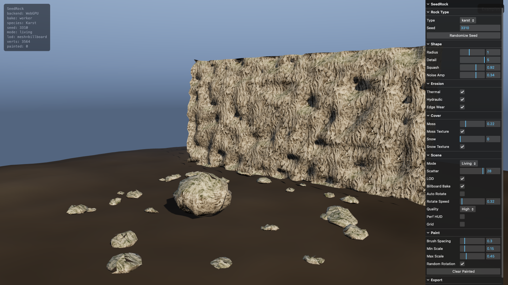

</div>

A fully procedural rock **and beyond** generator: pick a species, tune its parameters, and get a unique, textured, erosion-sculpted 3D mesh you can drop into a scene or export to glTF. **Paint rocks directly onto terrain**, render in **three styles** (PBR / Low Poly / Toon), or generate a full living scene in one click.

The live viewer opens to a **curated Karst canyon** — cliff face, scattered boulders, moss, and atmospheric terrain — not a debug grid on a gray plane.

> **Status: `1.3`.** Fifteen species across rocks + crystal + ice, three render styles, terrain scatter-painting, collider export, moss & snow overlays, full LOD + impostor pipeline, AI texture workflow, tests.

### Three render styles — one seed, three looks

<div align="center">
<table>
<tr>
<td align="center"><a href="https://reed-soul.github.io/SeedRock/?species=granite&seed=42&scene=single&style=pbr">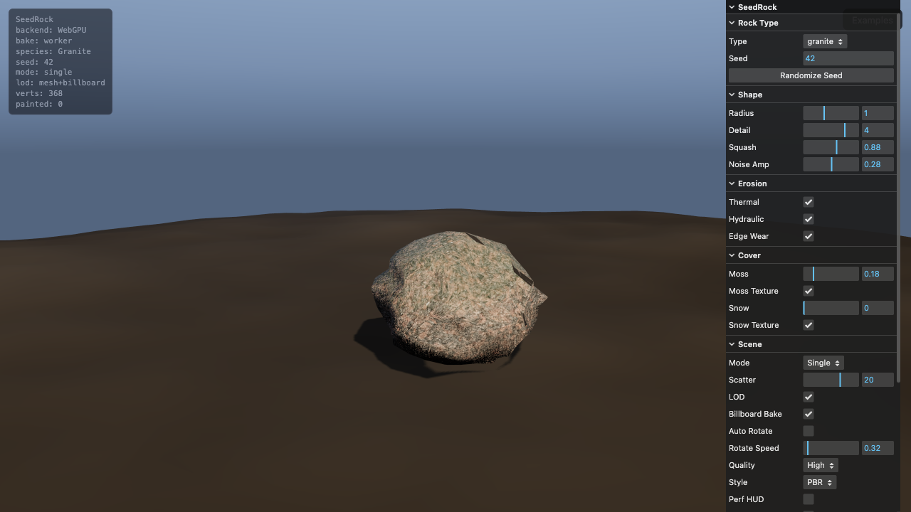<br><sub><b>PBR</b> — realistic</sub></a></td>
<td align="center"><a href="https://reed-soul.github.io/SeedRock/?species=granite&seed=42&scene=single&style=lowpoly"><br><sub><b>Low Poly</b> — flat-shaded</sub></a></td>
<td align="center"><a href="https://reed-soul.github.io/SeedRock/?species=granite&seed=42&scene=single&style=toon">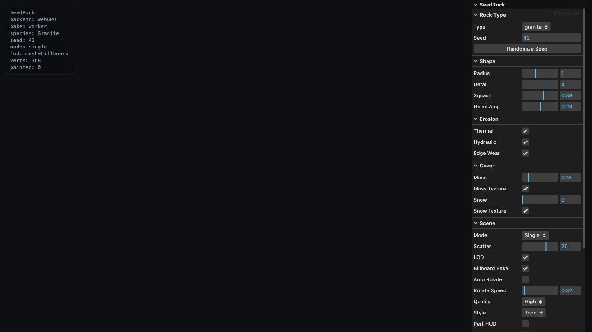<br><sub><b>Toon</b> — cel + ink outline</sub></a></td>
</tr>
</table>
</div>

### Fifteen species — rocks, crystals, ice

<div align="center">
<table>
<tr>
<td align="center"><a href="https://reed-soul.github.io/SeedRock/?species=granite&seed=42&scene=living&moss=0.15">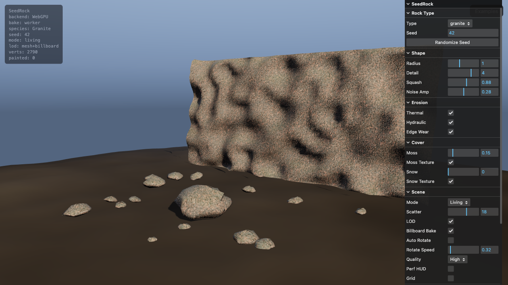<br><sub>Granite</sub></a></td>
<td align="center"><a href="https://reed-soul.github.io/SeedRock/?species=sandstone&seed=117&scene=living">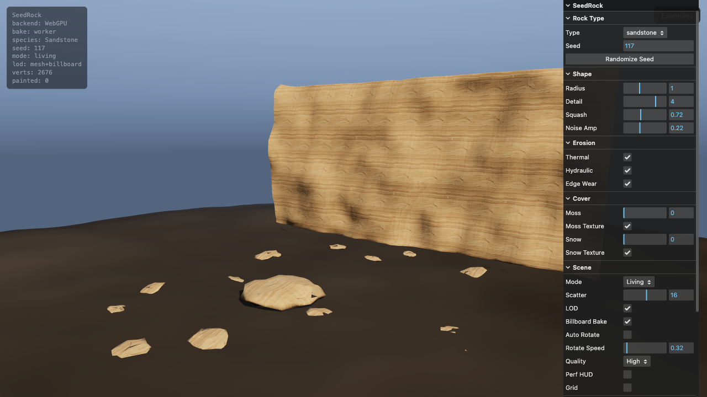<br><sub>Sandstone</sub></a></td>
<td align="center"><a href="https://reed-soul.github.io/SeedRock/?species=basalt&seed=88&scene=living">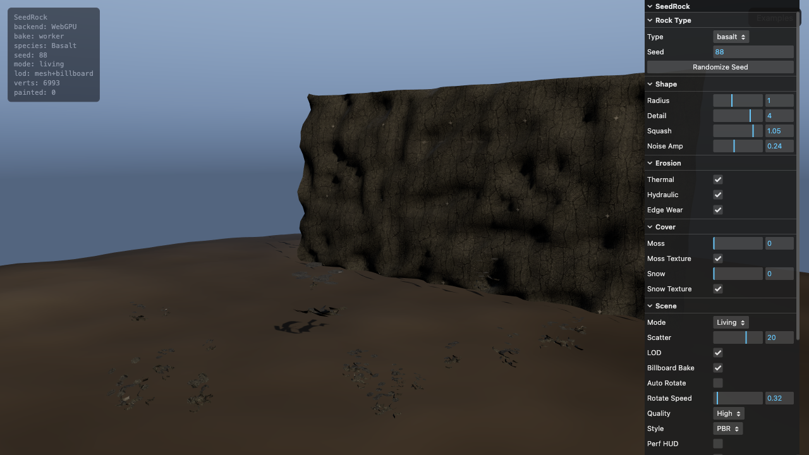<br><sub>Basalt <sub>columnar</sub></sub></a></td>
<td align="center"><a href="https://reed-soul.github.io/SeedRock/?species=limestone&seed=204&scene=living&moss=0.10">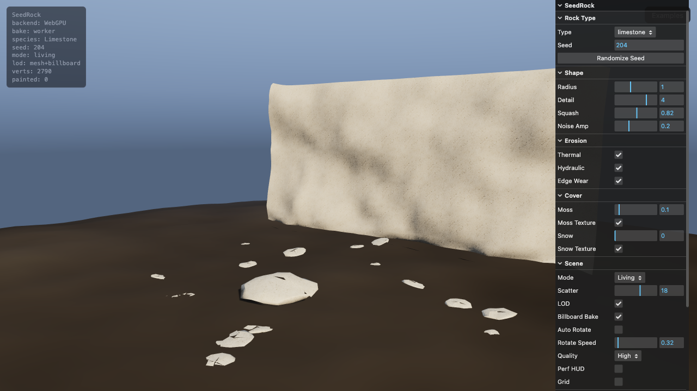<br><sub>Limestone</sub></a></td>
<td align="center"><a href="https://reed-soul.github.io/SeedRock/?species=volcanic&seed=13&scene=living">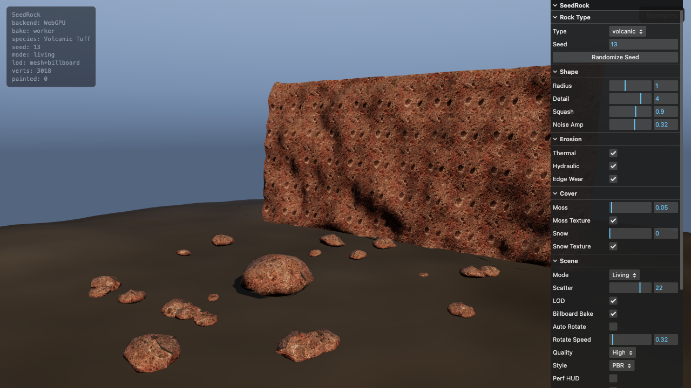<br><sub>Volcanic</sub></a></td>
</tr>
<tr>
<td align="center"><a href="https://reed-soul.github.io/SeedRock/?species=glacial&seed=3310&scene=living&moss=0.30">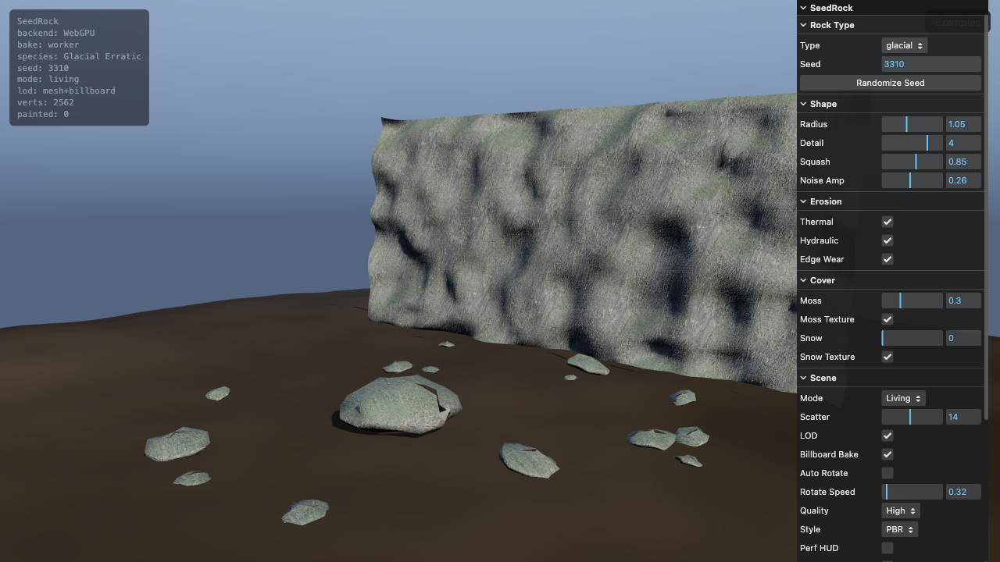<br><sub>Glacial</sub></a></td>
<td align="center"><a href="https://reed-soul.github.io/SeedRock/?species=riverCobble&seed=77&scene=living&moss=0.20">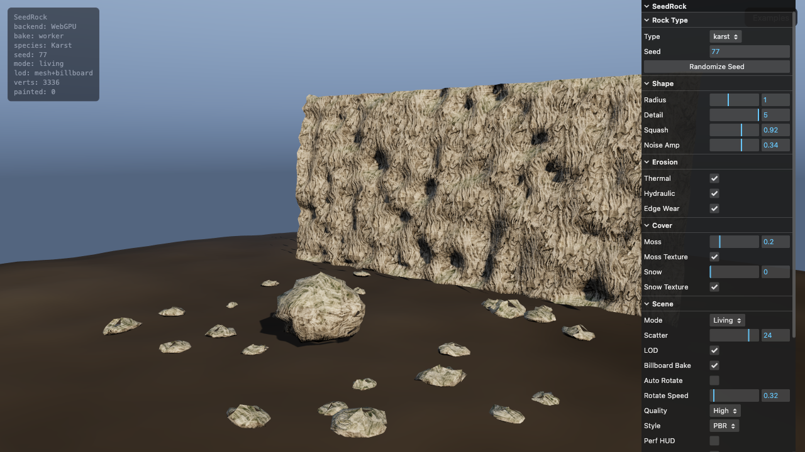<br><sub>River Cobble</sub></a></td>
<td align="center"><a href="https://reed-soul.github.io/SeedRock/?species=karst&seed=3310&scene=living&moss=0.18">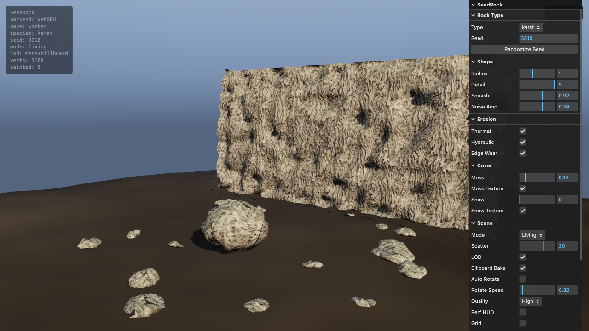<br><sub>Karst</sub></a></td>
<td align="center"><a href="https://reed-soul.github.io/SeedRock/?species=schist&seed=256&scene=living&moss=0.12">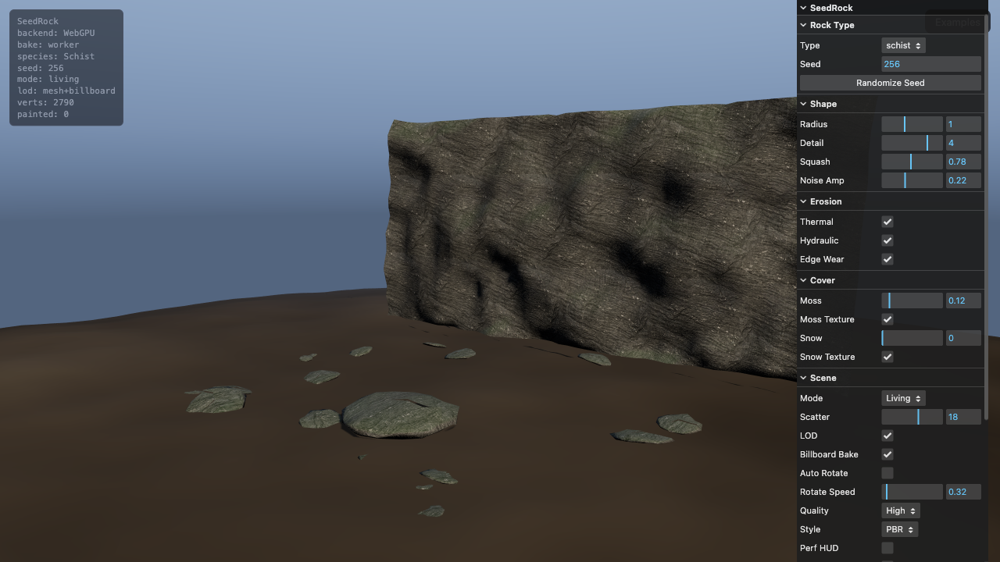<br><sub>Schist</sub></a></td>
<td align="center"><a href="https://reed-soul.github.io/SeedRock/?species=slate&seed=512&scene=living&moss=0.05">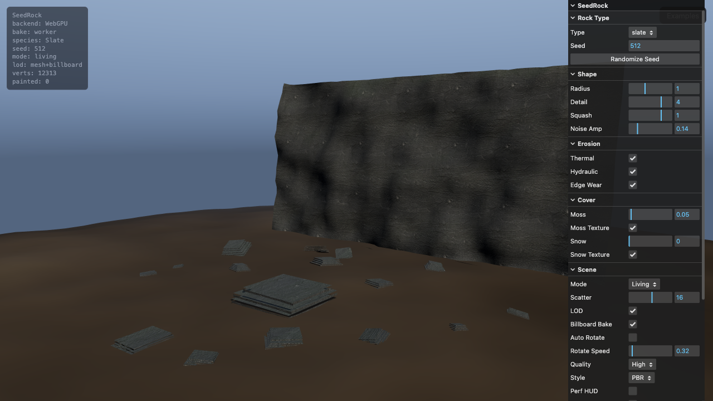<br><sub>Slate <sub>foliated</sub></sub></a></td>
</tr>
<tr>
<td align="center"><a href="https://reed-soul.github.io/SeedRock/?species=marble&seed=200&scene=living">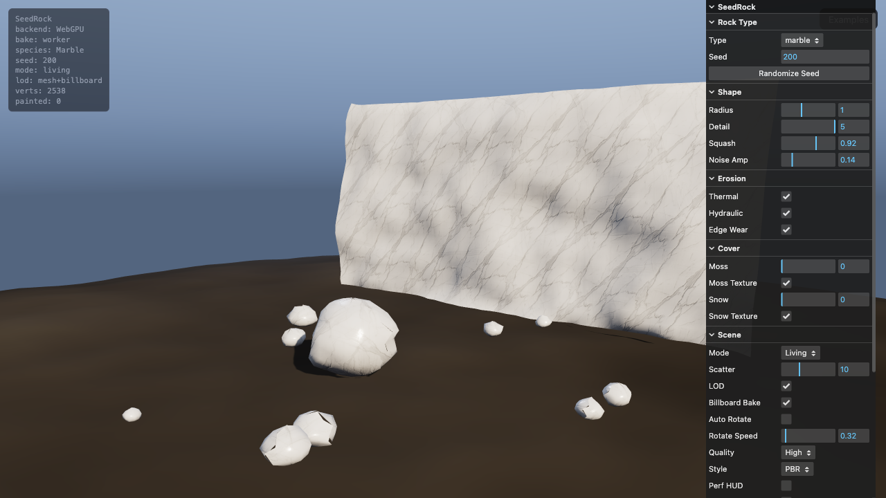<br><sub>Marble</sub></a></td>
<td align="center"><a href="https://reed-soul.github.io/SeedRock/?species=obsidian&seed=13&scene=living">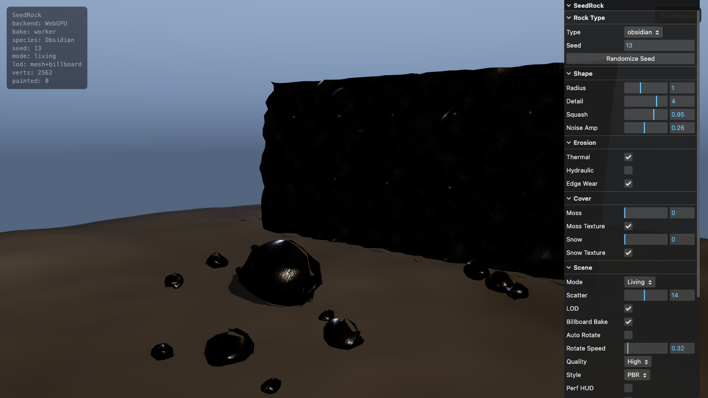<br><sub>Obsidian</sub></a></td>
<td align="center"><a href="https://reed-soul.github.io/SeedRock/?species=crystal&seed=88&scene=living">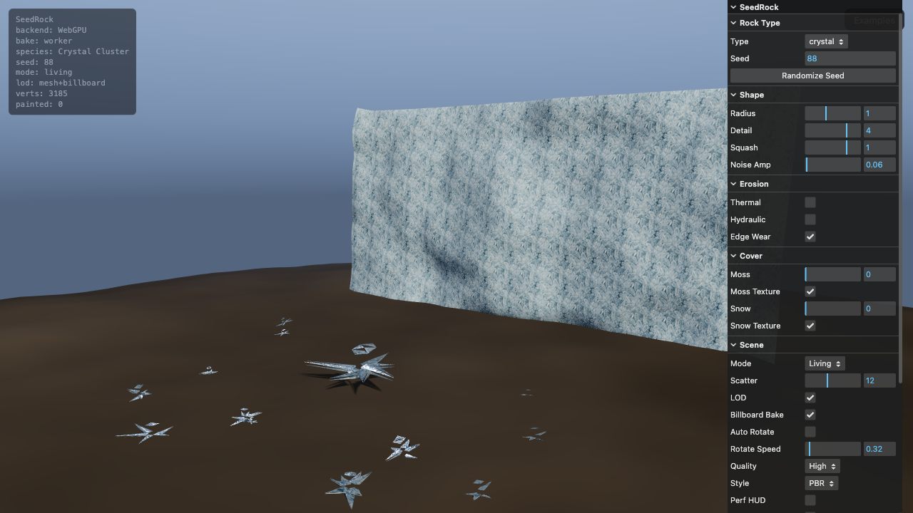<br><sub>Crystal <sub>cluster</sub></sub></a></td>
<td align="center"><a href="https://reed-soul.github.io/SeedRock/?species=ore&seed=64&scene=living">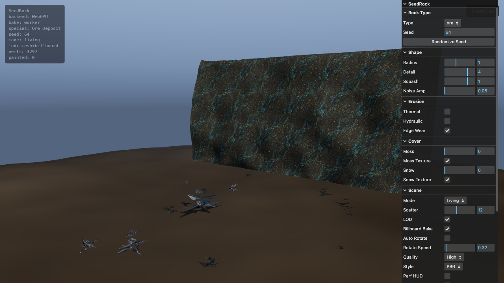<br><sub>Ore <sub>vein</sub></sub></a></td>
<td align="center"><a href="https://reed-soul.github.io/SeedRock/?species=ice&seed=3310&scene=living&moss=0.10">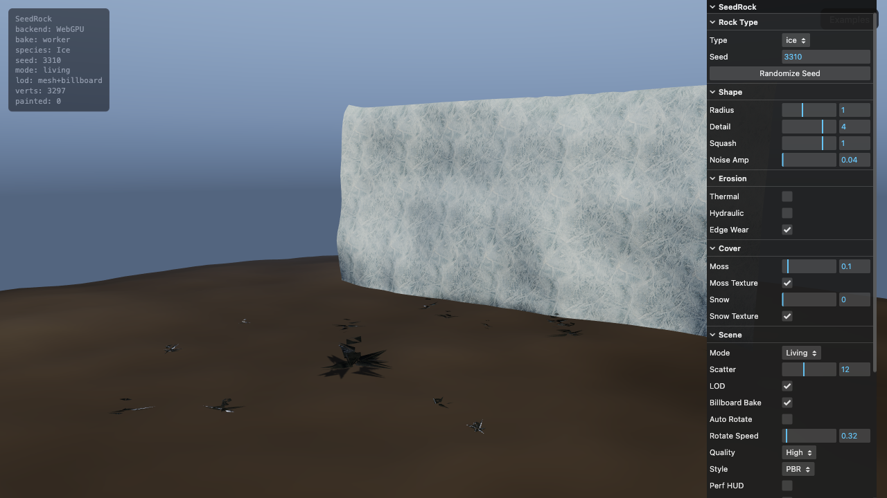<br><sub>Ice <sub>translucent</sub></sub></a></td>
</tr>
</table>
</div>

*Click any tile to open it in the live viewer.* Four geometry primitives (boulder / columnar / slate / crystal) drive the silhouettes; each species carries its own erosion profile, noise scales, and a 1024px AI-derived PBR set.

## Features

- **Three render styles** — PBR (realistic), Low Poly (flat-shaded), Toon (cel shading + ink outline)
- **Fifteen species** — nine rocks + slate/marble/obsidian (metamorphic & volcanic glass) + crystal/ore (mineral clusters) + ice (transmission)
- **Four form primitives** — boulder, columnar (hex-prism colonnades), slate (foliated slabs), crystal (radiating shard clusters)
- **Terrain scatter-painting** — brush rocks directly onto the terrain; painted rocks survive species changes and export with the scene
- **Collider export** — GLB includes a `<rock>_collider` physics proxy (reduced-LOD geometry) for Unity/Godot/Unreal import
- **Erosion simulation** — hydraulic, thermal, and edge-wear passes on every rock
- **PBR textures** — 1024px AI albedo (Gemini) + Sobel-derived normal/roughness/AO per species
- **Moss / snow overlays** — slope-driven biome cover with dedicated PBR texture sets
- **LOD chain** — mesh LODs + off-thread billboard impostor bake
- **glTF export** — MSFT_lod extension with `_LOD0`…`_LOD3` naming
- **Living scene** — cliff face + scatter boulders + atmospheric terrain

## What's next

- Community-submitted species presets ([CONTRIBUTING.md](CONTRIBUTING.md) · [docs/COMMUNITY_SPECIES.md](docs/COMMUNITY_SPECIES.md))

## Requirements

- **Node.js** 18+
- A **WebGPU-capable browser** (Chrome 113+ / Edge). WebGL2 fallback will be included.

## Run it

```bash
pnpm install
pnpm textures        # procedural PBR maps (fallback; 512px)
pnpm textures:prompts  # print AI generation prompts for each species
# Generate AI albedo with your image model, then derive + ingest the full PBR set:
pnpm textures:derive ai-output/granite_albedo.png        # → normal/roughness/ao from albedo
pnpm textures:ingest -- --species granite --dir ./ai-output/  # copy into public/assets/textures/
pnpm dev               # http://localhost:5390  ·  examples at /examples.html
pnpm test              # unit tests
```

```bash
pnpm build    # production bundle in dist/
pnpm preview  # serve the built bundle
```

## Contributing

See [CONTRIBUTING.md](CONTRIBUTING.md), [docs/COMMUNITY_SPECIES.md](docs/COMMUNITY_SPECIES.md), and [docs/AI_TEXTURES.md](docs/AI_TEXTURES.md).

## Architecture

```
src/
├── core/           # Three.js scene setup, camera, renderer
├── generator/      # Rock mesh generation (noise + erosion)
├── species/        # Rock type presets (granite, basalt, etc.)
├── materials/      # PBR material pipeline
├── export/         # glTF export
├── ui/             # lil-gui control panel
└── main.js         # Entry point
assets/
└── (legacy)        # use public/assets/textures for generated PBR maps
public/
└── assets/textures/  # PBR maps (pnpm textures)
scripts/
└── texture/        # Texture generation pipeline
```

## Adding a rock type

New rocks are added by dropping in a **preset** and a set of **generated textures** — no engine changes:

1. **Write the preset** in `src/species/<name>.js` — define erosion params, noise scales, texture bindings, and LOD thresholds. Add a `roughBase` entry to `derive-pbr.mjs` so derived roughness matches the species.
2. **Generate the albedo** with an AI image model (gpt-image-2 / Flux / Gemini via `opencli`), then derive the rest of the PBR set and ingest:
   ```bash
   pnpm textures:derive ai-output/<id>_albedo.png        # → normal/roughness/ao (Sobel + cavity)
   pnpm textures:ingest -- --species <id> --dir ./ai-output/
   ```
3. **Register** in `src/species/index.js`.

## Tech stack

| Component | Tool |
|-----------|------|
| 3D Engine | Three.js 0.184+ (WebGPU) |
| Build | Vite 8 |
| UI | lil-gui |
| Textures | AI-generated (gpt-image-2 / Flux) |
| Export | glTF / GLB |

## AI-assisted workflow

Following the same cross-agent collaboration model as [SeedThree](https://github.com/SkyeShark/SeedThree):

- **Coding agent** (Claude Code / Codex) — engine, erosion algorithms, material pipeline, scene
- **Image generation** (Gemini via `opencli`) — one 1024px albedo per species; `pnpm textures:derive` derives normal/roughness/AO from each albedo
- **Community** — rock type presets and textures submitted as PRs

## Roadmap

- [x] Repo init & architecture design
- [x] Core noise-based mesh generator
- [x] Hydraulic erosion simulation
- [x] First rock type: Granite
- [x] PBR material pipeline (procedural fallback; texture-ready triplanar)
- [x] lil-gui control panel
- [x] glTF export
- [x] Additional rock types (5+)
- [x] Moss / lichen overlay system
- [x] Snow overlay textures
- [x] Optional ambient-occlusion maps
- [x] LOD chain + impostor baking
- [x] Living scene (cliff face + scatter)
- [x] GitHub Pages live demo
- [x] Glacial rock type
- [x] AI texture prompts + ingest pipeline
- [x] Full AI PBR set for all species (Gemini albedo + Sobel-derived normal/roughness/AO)
- [x] Terrain scatter-painting (brush rocks directly onto the ground)
- [x] Stylization pipeline — PBR / Low Poly / Toon render styles
- [x] Form primitives — columnar / slate / crystal geometry (beyond displacement spheres)
- [x] Species expansion — marble / obsidian / ore / slate / crystal / ice (9 → 15)
- [x] Toon outline pass (BackSide-normal-extruded ink line)
- [x] Ice with transmission material (MeshPhysicalNodeMaterial, ior 1.31)
- [x] Auto collider proxy in GLB export (`*_collider` for engine physics import)
- [x] Community contribution docs + CI tests

## License

[MIT](LICENSE)

## Acknowledgements

Inspired by [SeedThree](https://github.com/SkyeShark/SeedThree) and the procedural generation community.
